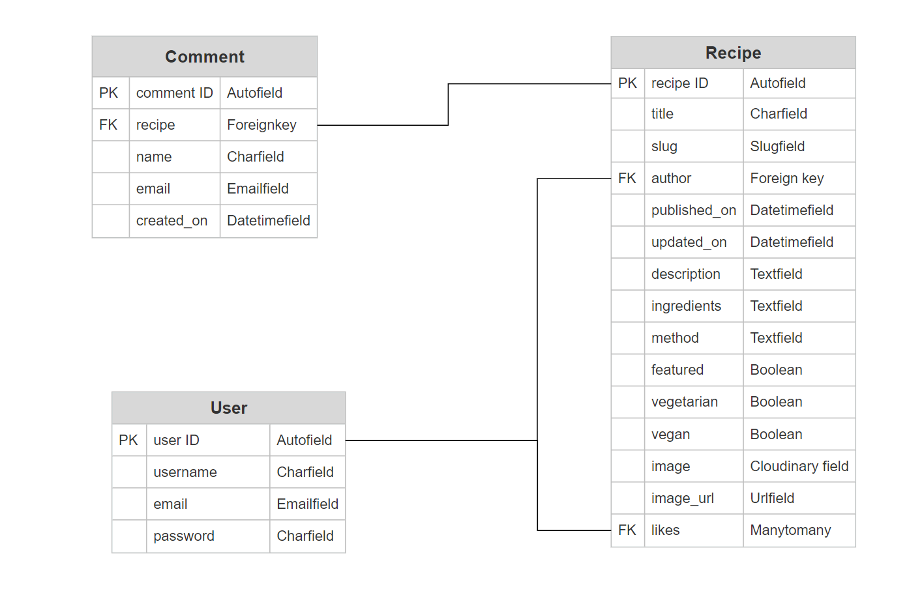

# Eat Me!

Here is a link to the live project. (https://eatmeproject.herokuapp.com/)

Eat me! is a website where users come together to share their favourite created recipes. It is built using the Django Framework in python.

## Contents 

- [User Experience (UX)](#user-experience-ux)
   * [User Stories](#user-stories)
   
- [Design](#design)
   * [Colour Scheme](#colour-scheme)
   * [Typography](#typography)
   * [Imagery](#imagery)
   * [Wireframes](#wireframes)
   * [Database Schema](#database-schema)

- [Features](#features)
   * [Home page](#home-page)
   * [Accounts](#accounts)
   * [All Recipes page](#all-recipes-page)
   * [Favourite Recipes](#favourite-recipes)
   * [Your Recipes](#your-recipes)
   * [Searched Recipes](#searched-recipes)
   * [Recipe Detail page](#recipe-detail-page)
   * [Add Recipe page](#add-recipe-page)
   * [Edit Recipe page](#edit-recipe-page)

- [Technologies](#technologies)
   * [Languages used](#languages-used)
   * [Libraries & Programs Used](#libraries-and-programs-used)

- [Testing](#testing)
  
- [Deployment](#deployment)
   * [Github pages](#github)
   * [Django and Heroku](#django-and-heroku)
   * [Forking](#forking)
   * [Clone](#clone)

- [Credits](#credits)
   * [Code](#code)
   * [Media](#media)

## User Experience (UX)

A visitor to Eat Me! would be someone who is most likely an adult who is looking to either find new recipes or to share their own creations. 

## User Stories 

A list of my user stories and their tasks can be found [here](https://github.com/delboy/eatme/issues).

### EPIC | Navigation
- As a User I can immediately understand the website's purpose so that I know if it's what I'm looking for.
- As a User I can navigate around the site so that I can easily view desired content.
- As a User I can view a list of recipes so that I can choose one to read.
- As a User I can click on a recipe so that I can read the recipe details.
- As a User I can search recipes so that I can find specific recipes I'm looking for.

### EPIC | User's Recipes
- As a User I can create recipes so that other users can view them
- As a User I can view my recipes so that I can see and manage all recipes I have created.
- As a User I can edit recipes so that I can update any changes or mistakes to my recipes.
- As a User I can delete recipes so that I can remove any unwanted recipes I have made.
- As a User I can view all my liked recipes so that I can return to them with ease.

### EPIC | User Interaction
- As a User I can like/unlike recipes so that I can mark which recipes I enjoyed.
- As a User I can comment on recipes so that I can give my feedback to others.
- As a User I can view the number of likes on a recipe so that I can see which is most popular.
- As a User I can view comments on recipes so that I can read other user's feedback.

### EPIC | Sign in
- As a User I can register for an account so that I can begin to use the services afforded to members.
- As a User I can log in/out so that I can like recipes, comment on recipes and manage my recipes.
- As a User I can see my login status so that I know if I'm logged in or out.

### EPIC | Admin
- As an Admin I can view, create, edit and delete all recipes and comments so that I can control the website's content.
- As an Admin I can feature recipes so that I can highlight them on the home page.

## Design

The look of this website was based loosely around The Code Institute's 'I think therefore I Blog' project.  

### Colour Scheme
- I wanted to keep the colour scheme simple so I stuck with black, white and different shades of grey. This is because the uploaded pictures from users could be any host of colours, so by keeping the colour scheme neutral the site minimises the risk of clashing with any images, keeping them the main focus of the user.

### Typography
- On the site I will be using the default bootstrap fonts as I find them clean, elegant and easy to read so I feel they will fit in with the site's theme nicely. The only font used on the site will be Imbue which is solely used to style the logo.

### Imagery
- All the imagery will be food related with only 4 images being static. The rest will be uploaded by various users.

### Wireframes

Wireframes for each page are linked here:

* [Home Page](assets/documents/home_page.pdf)
* [All Recipes](assets/documents/all_recipes.pdf)
* [Detailed Recipe](assets/documents/detailed_recipe.pdf)
* [Your Recipes](assets/documents/your_recipes.pdf)
* [Favourite Recipes](assets/documents/favourite_recipes.pdf)
* [Searched Recipes](assets/documents/searched_recipes.pdf)
* [Add Recipe](assets/documents/add_recipe.pdf)
* [Register, log in/out](assets/documents/register_log_in_out.pdf)

### Database Schema 

*<i>note</i> - I forgot to add a Body section to the Comment table when designing. By the time I realised that I left it out my trial period for the schema creator website had expired so could not rectify the mistake.

## Features

### Home Page

- #### Navigation bar
    - The navigation bar is present at the top of every page and houses all links to the various other pages.
    - The active page will be shown to have a bolder font helping users understand what page they're on.
    - Hovering over the links will darken the font.
    - The options to Register or Log in will change to the option to log out once a user has logged in. 
    - Once a user has signed in, more options such as 'Your Recipes' and 'Favourite Recipes' become available.
    - Text will also appear in the bar stating which user is signed in if any.
    - A search bar is nested in the navbar to find recipes quickly.
    - The navbar is fully responsive, collapsing into a hamburger menu when the screen size becomes too small. 

    

- #### Hero Image
    - The hero image welcomes the user with a short message advertising what the website is about.
    - A button to sign up and a short message is present in the image. Clicking this takes you to the register an account page.
    - If a user is already signed the message changes to 'welcome back' and the sign up button changes to a 'view recipes' button, which takes you to the all recipes page.

    

- #### Carousel
    - The carousel displays any recipes that the admin has selected to be featured.
    - Clicking the image will take you to that recipe's detail page.
    - Buttons on the edge if the carousel scroll through all the featured recipes.

    

- #### Most Loved Recipes
    - The most loved recipes section displays the top 5 recipes with the most likes.
    - Clicking each recipe takes you to its detail page.
    - A link to all recipes can be found at the bottom of the list.

    

- #### Features
    - This section displays a couple short messages with images to showcase the site's basic features.

    

- #### Footer
    - The footer rests at the bottom of each page and has links to all social media accounts.
    - Clicking the links in the footer opens a separate browser to avoid pulling the user away from the site.

    

### Accounts
- #### Register Page
    - The register page is used to create an account.

    

- #### Login Page
    - The login page is used to log in users with an existing account.
    - A success message will appear once a user successfully logs in.

    

- #### Log out Page
    - The log out page is used to log out users who are signed in.
    - A success message will appear once a user successfully logs out.

    

### All Recipes Page

- #### Recipe Cards
    - The site will paginate all recipe cards to display 6 to a page.
    - Each card will display the recipe's image, Title, Author, Description, Published date and how many likes it has received.
    - If the recipe is vegetarian or vegan a small green corresponding label will be present in the bottom left corner.
    - Clicking anywhere inside the recipes card will take you directly to that recipes detail page.

    

### Favourite Recipes Page

- #### Favourite Recipes
    - This page shows only recipes that the user has liked.
    - If a user tries to access this page without being signed in they will receive a not logged in error.

    

### Your Recipes Page

- #### Your Recipes
    - This page displays only the recipes that the user has created. 
    - At the top of the page is an 'Add Recipe' button which takes the user to the add recipe page.
    - Each recipe will have two buttons, an edit and a delete button.
    - The edit button will take users to the edit recipe page for that particular recipe.
    - Clicking the delete button will bring up a modal which asks the user if they are sure they want to delete that particular recipe.
    - A success message appears if a recipe is deleted successfully. 
    - If a user tries to access this page without being signed in they will receive a not logged in error. 

    

### Searched Recipes Page

- #### Searched Recipes
    - Anything entered into the search bar in the navigation bar displays results here.
    - If the word vegetarian, or vegan is entered into the search bar it will result in all vegetarian or vegan recipes and not just ones with those words in the title. 

    

### Recipe Detail Page

- #### Recipe Card
    - At the top of the page the recipe card will show the image, title, author, published date and any dietary information.

    

- #### Main Section
    - The main body of the page consists of the description, ingredients, and method. These combined is what creates the whole recipe.
    - At the bottom of the section is an icon and counter for both likes and comments.
    - Clicking the outlined heart renders the recipe 'liked' by the user which will fill in the heart, add 1 to the counter, and add the recipe to the users favourite recipes page.
    - Alternatively, clicking a filled in heart renders the recipe 'unliked' which will change the heart back to an outline, reduce the counter by 1 and remove the recipe from the users favourite recipe page.

    

- #### Comments
    - At the bottom of the page is the comment section. Here you can view all comments left by users.
    - Only signed in users can leave a comment.
    - Comments with profanity automatically fail and will not upload.
    - Any comments left by the user that is currently signed in can be edited or deleted.
    - A success message appears once comments are left.
    - A success message appears once comments are deleted.
    - If a user tries to edit a comment without being signed in they receive a not logged in error.
    - If a user tries to edit a comment that does not belong to them they receive a forbidden access error. 

    

### Add Recipe Page

- #### Adding Recipes
    - The adding recipe page is where users upload their creations.
    - Each recipe is uploaded by filling out a form.
    - Failing to fill out either the recipes Title, Description, Ingredients, or Method results in the form failing and rendering a message stating which fields you have missed.
    - Using profanity will result in the form failing and the relevant section will be flagged with a message.
    - The form has two checkbox's that toggle whether the recipe is suitable for vegetarians or vegans. 
    - Clicking the vegan checkbox automatically checks the vegetarian checkbox and subsequently unchecking the vegetarian box unchecks the vegan box.
    - The user has two options to upload an image of their recipe. They can either choose a file to upload or simply put in the URL address of the image. 
    - If neither of the image options are used a default image will be generated.
    - An add Recipe button is present at the bottom of the page once the form is ready to send.
    - If a user tries to access this page without being signed in they will receive a not logged in error.
    - A success message appears once a recipe is added successfully.  

    

### Edit Recipe Page

- #### Editing Recipes
    - Editing a recipe brings up the form that was filled in when the recipe was created and has all the fields filled out with the original content.
    - Changing the content and hitting save at the bottom of the page saves the recipe.
    - A success message appears once a recipe is edited successfully.
    - If a user tries to access this page without being signed in they will receive a not logged in error.
    - If a user tries to edit a recipe that does not belong to them they receive a forbidden access error.

    

## Technologies

### Languages used

- [HTML5](https://en.wikipedia.org/wiki/HTML5)
- [CSS3](https://en.wikipedia.org/wiki/Cascading_Style_Sheets)
- [Javascript](https://en.wikipedia.org/wiki/JavaScript)
- [Python](https://www.python.org/)

### Libraries and Programs Used

- [Git](https://git-scm.com/)
    - Version control.
- [GitHub](https://github.com/)
    - For storing code and deploying the site.
- [Gitpod](https://www.gitpod.io/)
    - Used for building and editing my code.
- [Django](https://www.djangoproject.com/)
    - A python based framework that was used to develop the site.
- [Bootstrap](https://getbootstrap.com/)
    - For help designing the html templates.
- [Google Fonts](https://fonts.google.com/)
    - Used to style the website's logo.
- [Font Awesome](https://fontawesome.com/)
    - Used to obtain the icons used.
- [Google Developer Tools](https://developers.google.com/web/tools/chrome-devtools)
    - Used to help fix problem areas and identify bugs.
- [Cloudinary](https://cloudinary.com/)
    - Used to store static files and images.
- [Favicon.io](https://favicon.io/)
    - Used to generate the site's favicon.
- [SQlite](https://www.sqlite.org/index.html)
    - Used when performing unit tests.
- [PostgreSQL](https://www.postgresql.org/)
    - Database used through heroku.
- [SmartDraw](https://cloud.smartdraw.com/)
    - To draw out the database schema.
- [Balsamiq](https://balsamiq.com/)
    - To create the wireframes.
- [W3C Markup Validation Service](https://validator.w3.org/) 
    - Used to validate HTML code.
- [W3C CSS Validation Service](https://jigsaw.w3.org/css-validator/#validate_by_input)
    - Used to validate CSS code.
- [Pep8](http://pep8online.com/)
    - Used to validate Python code.
- [JSHint](https://jshint.com/)
    - Used to validate JS code.
- [Summernote](https://summernote.org/)
    - Used to add a WYSIWYG text box to the add recipe page.
- [Profanity Filter](https://github.com/ReconCubed/django-profanity-filter)
    - App used to remove profanity from recipes and comments.
- [Tinyjpg](https://tinyjpg.com/)
    - Used to compress images.
- [Screen to Gif](https://www.screentogif.com/)
    - Used to create gifs for my readme.
- [Heroku](https://www.heroku.com/)
    - To deploy project.

## Testing 

Testing and results can be found [here](TESTING.md)

## Deployment

This project was deployed using Github and Heroku.

- ### Github 

    To create a new repository I took the following steps:

    1. Logged into Github.
    2. Clicked over to the ‘repositories’ section.
    3. Clicked the green ‘new’ button. This takes you to the create new repository page.
    4. Once there under ‘repository template’ I chose the code institute template from the dropdown menu.
    5. I input a repository name then clicked the green ‘create repository button’ at the bottom of the page.
    6. Once created I opened the new repository and clicked the green ‘Gitpod’ button to create a workspace in Gitpod for editing.

- ### Django and Heroku

    To get the Django framework installed and set up I followed the Code institutes [Django Blog cheatsheet](https://codeinstitute.s3.amazonaws.com/fst/Django%20Blog%20Cheat%20Sheet%20v1.pdf).

    
- ### Forking

    To fork my project you must;
    1. Sign in to Github and go to my [repository](https://github.com/Delboy/Colour-Type)
    2. Locate the Fork button at the top right of the page.
    3. Select this. 
    4. The fork is now in your repositories.

- ### Clone
    To clone my project you must;

    1. Sign in to Github and go to my [repository](https://github.com/Delboy/Colour-Type)
    2. Above the list of files click the green ‘code’ button.
    3. This will bring up a few options as to how you would like to clone. You can select HTTPS, SSH or Github CLI, then click the clipboard icon to copy the URL.
    4. Open git bash
    5. Type ‘git clone’ and then paste the URL you copied. Press Enter.

    For more information on cloning check out the github documentation [here](https://docs.github.com/en/repositories/creating-and-managing-repositories/cloning-a-repository)

## Credits

### Code

 -  I learnt how to change the fields label inside forms from this thread on [stackoverflow.com](https://stackoverflow.com/questions/636905/django-form-set-label).

 - I learnt how to reflect the active page in the navbar here on [tekshinobi.com](https://tekshinobi.com/setting-active-navbar-link-in-django-template/).

 ### Media

 - The hero image was taken from [coop.co.uk](https://www.coop.co.uk/recipes/earl-grey-poached-pears-with-ice-cream).
 - All other food images were taken from [bbc.co.uk/food](https://www.bbc.co.uk/food).

