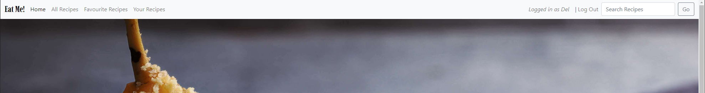
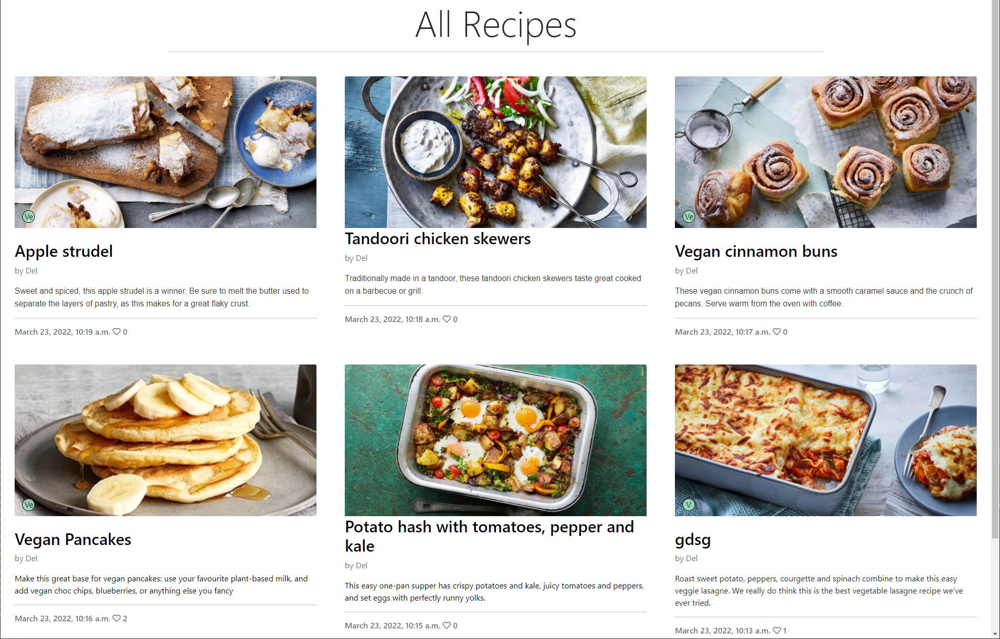
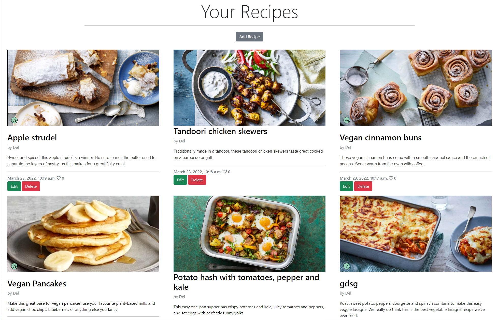
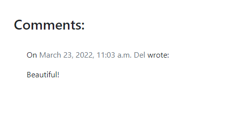
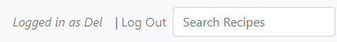
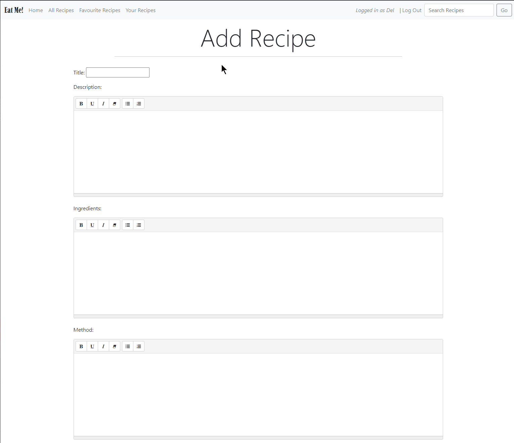

# Eat Me! - Testing

## Validators
- HTML
    - No errors were returned when passing through the official[W3C validator](https://validator.w3.org/nu/?doc=https%3A%2F%2Featmeproject.herokuapp.com%2F)
- CSS 
     - No errors were found when passing through the official [(Jigsaw) validator](https://jigsaw.w3.org/css-validator/validator?uri=https%3A%2F%2Featmeproject.herokuapp.com%2F&profile=css3svg&usermedium=all&warning=1&vextwarning=&lang=en)
- JavaScript
    - No errors were found when passing through [Jshint](https://jshint.com/)
- Python
    - No errors were found when passing through [PEP8](http://pep8online.com/)
- Lighthouse

    
## User Story Testing

### EPIC | Navigation
*As a User I can immediately understand the websites purpose so that I know if its what im looking for.*
- As soon as a user arrives on the home page they are welcomed by a brief message explaining the sites purpose.

*As a User I can navigate around the site so that I can easily view desired content.*
- A navigation bar sits at the top of every page with the current page's link darkened.

*As a User I can view a list of recipes so that I can choose one to read.*
- The all recipes page shows a list of every page on the site.

*As a User I can click on a recipe so that I can read the recipe details.*
- Clicking anywhere inseide a recipes card will take you directly to the recipes page.

*As a User I can search recipes so that I can find specific recipes im looking for.*
- In the top righthand corner of the navigation bar is a search bar.

### EPIC | User's Recipes
*As a User I can create recipes so that other users can view them.*
- Once a user has created an account they can navigate to 'Your Recipes' and from there can enter a recipe by clicking the add recipe button and filling out the subsequent form. Once created they will appear on the All Recipes page.

*As a User I can view my recipes so that I can see and manage all recipes I have created.*
- All the users created recipes are available to see and manage on the 'Your Recipes' page.

*As a User I can edit recipes so that I can update any changes or mistakes to my recipes.*
- On the 'Your Recipes' page each recipe will have a 'Edit' button which can be used to edit the recipe.

*As a User I can delete recipes so that I can remove any unwanted recipes I have made.*
- On the 'Your Recipes' page each recipe will have a 'Delete' button which can be used to delete the recipe.

*As a User I can view all my liked recipes so that I can return to them with ease.*
- All recipes that the user has liked will appear in the 'Favourite Recipes' page.

### EPIC | User Interaction
*As a User I can like/unlike recipes so that I can mark which recipes I enjoyed.*
- Each recipe has a heart button which can be toggled by signed in users to like/unlike the recipe.

*As a User I can comment on recipes so that I can give my feedback to others.*
- Each recipe has a comment section that can be used by users that are signed in.

*As a User I can view the number of likes on a recipe so that I can see which is most popular.*
- Each recipe has a counter next to the like button which displays the total likes.

- The home page also has a Most Loved section that displays the most liked recipes.

*As a User I can view comments on recipes so that I can read other user's feedback.*
- Every comment left is displayed at the bottom of the recipes page.

### EPIC | Sign in
*As a User I can register for an account so that I can begin to use the services afforded to members.*
- In the navbar is a register link that takes you to the sign up page.

- There is also a sign up button located on the index page which also takes you to the sign up page.

*As a User I can log in/out so that I can like recipes, comment on recipes and manage my recipes.*
- In the navbar there is a link to log in or log out.

*As a User I can see my login status so that I know if i'm logged in or out.*
- If logged in a message will appear in the navbar stating what account is logged in.

### EPIC | Admin
*As a Admin I can view, create, edit and delete all recipes and comments so that I can control the websites content.*
- Admins have full access to CRUD functionallity for both recipes and comments in the admins page.

*As a Admin I can feature recipes so that I can highlight them on the home page.*
- Admins can select any recipe to be featured form the admins page.

## Feature Testing

### Home Page

- #### Navigation bar
    - Checked all the links on the navbar render the correct page and darken the active page's link.
    - Checked that clicking the logo returns to the home page.
    - Checked that clicking your log in status takes you to your recipes page.

     

- #### Hero Image
    - Checked that the sign up button takes you to the sign up page.
    - Checked the view recipes takes you to the all recipes page. 

     

     

- #### Carousel
    - Checked that featured recipes appear in the carousel.
    - Checked that clicking the image takes you to the correct recipe's detail page.
    - Checked that the buttons on the edge of the carrousel scroll through all the featured recipes.

     

     

- #### Most Loved Recipes
    - Checked that the list is no longer then 5.
    - Checked that clicking each recipe takes you to the correct recipe's detail page.
    - Checked that the all recipes link can takes you to the all recipes page.

     

- #### Footer
    - Checked that clicking the links in the footer takes you to the correct page in a seperate browser.

    

### Accounts
- #### Register Page
    - Checked that using the register page creates an account.

    

- #### Log in Page
    - Checked that the log in page logs you in.
    - Checked that a success message will appear once you successfully log in.

    

- #### Log out Page
    - Checked that the log out page logs you out.
    - Checked that a success message will appear once you successfully log out.

    

### All Recipes Page

- #### Recipe Cards
    - Checked that the site will paginate 6 recipe cards to a page.
    - Checked that each card displays the recipes image, Title, Author, Description, Published date and how many likes it has recieved.
    - Checked that if the recipe is vegetarian or vegan a small green corosponding label is present in the bottom left corner.
    - Checked that clicking anywhere inside the recipes card takes you to the correct recipe's detail page.

    

### Favourite Recipes Page

- #### Favourite Recipes
    - Checked that this page shows only recipes that the user has liked.

    

    - Checked that if a user tries to access this page without being signed in they recieve a not logged in error.

    

### Your Recipes Page

- #### Your Recipes
    - Checked that this page displays only the recipes that the user has created. 
    - Checked that at the 'Add Recipe' button takes the user to the add recipe page.
    - Checked that each recipe has two buttons, an edit and a delete button.
    - Checked that the edit button takes the user to the edit recipe page for that particular recipe.
    - Checked that clicking the delete button brings up a modal which asks the user if they are sure they want to delete that particular recipe.
    - Checked that confirming to delete a recipe removes the recipe.
    - Checked that a success message appears when a recipe is deleted successfully.

    

    - Checked that if a user tries to access the page without being signed in they will recieve a not logged in error. 

    

### Searched Recipes Page

- #### Searched Recipes
    - Checked that whatever is searched in the search bar displays correct results.

    

    - Checked that if the word vegetarian, or vegan is entered into the search bar it will result in all vegetarian or vegan recipes and not just ones with those words in the title. 

    

### Recipe Deatail Page

- #### Recipe Card
    - Checked that at the top of the page the recipe card will show the image, title, author, published date and any dietry information.

    

- #### Main Section
    - Checked that the main body of the page consists of the decription, ingredients, and method.
    - Checked that the bottom section has an icon and counter for both likes and comments.
    - Checked that clicking the outlined heart fills in the heart, adds 1 to the counter, and adds the recipe to the users favourite recipes page.
    - Checked that clicking a filled in heart changes the heart back to an outline, reduces the counter by 1 and removes the recipe from the users favourite recipe page.

    

- #### Comments
    - Checked that you can view comments left.

    

    - Checked that only signed in users can leave a comment.
    - Checked that comments with profanity automatically fail and do not upload.
    - Checked that any comments left by the user that is currently signed in can be edited or deleted.
    - Checked that a success message appears once a comment is left.
    - Checked that a success message appears once a comment is deleted.

    

    - Checked that if a user tries to edit a comment without being signed in they recieve a not logged in error.

    

    - Checked that if a user tries to edit a comment that does not belong to them they recieve a foribiddn access error.  

    

### Add Recipe Page

- #### Adding Recipes
    - Checked that failing to fill out either the recipes Title, Description, Ingredients, or Method results in the form failing and renders a message stating which fields you have missed.

    

    - Checked that the form has two checkbox's that toggle wether the recipe is suitable for vegetarians or vegans. 
    - Checked that clicking the vegan checkbox automatically checks the vegetarian checkbox and subsequently unchcecking the vegetarian box unchecks the vegan box.

    

    - Checked that the user can uplaod an image by either uploading an image or by using the image's URL address.

    

    

    - Checked that a default image is used if neither of the image options are used.

    

    - Checked that the add Recipe button uploads the recipe.
    - Checked that a success message appears once a recipe is added successfully.

    

    - Checked that if a user tries to access this page without being signed in they will recieve a not logged in error.

      

### Edit Recipe Page

- #### Editing Recipes
    - Checked that editing a recipe brings up the form that was filled in when the recipe was created, and has all the fields filled out with the orginal content.
    - Checked that changing the content and hitting save at the bottom of the page saves the recipe.
    - Checked that a success message appears once a recipe is edited successfully.

      

    - Checked that if a user tries to access this page without being signed in they will recieve a not logged in error.

      

    - Checked that if a user tries to edit a recipe that does not belong to them they recieve a forbidden access error.

    

## Bugs

### Fixed 

- I had a problem where I couldnt get the proper image to display when uploading a recipe. I was originally tryin an if else statement that ran, if image, else if image_url, else default. This didnt work because cloudinary recognises the default image as an image present. I fixed this by changing the if statement to, if placeholder does not exist, use uploaded image, else if image url exists, use that, else use the default image.

- I had a bug that would change the width of the pages content when typing in the search bar. It only happened on pages that had paginated recipes with only 3 or less results. Using chrome dev tools I found the culprit to be a function of bootstrap. It had something to do with the way it was calculating the padding. I tried over riding the padding but nothing seemed to work. I found that if I added padding-right of 1px to every row class it fixed the issue. This however as you can imagine through off my margins every so slightly. It wasn't untill I was fixing another bug which was causing side scrolling to happen on phones that I fixed the issue without needing the row padding. It was as simple as hidding the overflow on the x axis.

- Log in/out options were not appearing in navbar hamburger menu. Needed to change the divs ID to include the options.

- When creating a recipe you could tick the checkbox to label the recipe vegan, which would automaticlly check the vegetarian checkbox, but you could then uncheck the vegetarian checkbox leaving the impossible situation of having a recipe not suitable for vegetarians but suitable for vegans. I fixed this by creating some script that unchecks the vegan box if unchecking the vegetarian box.

- No recipes were showing on the all recipes page when not logged in. This is because I accidently had if.user_authenticated written in my views for that function. Once removed all was working correctly.

- Pagination was not working. Upon checking the django documents I realised I hadnt coded correctly for class views. 

- An issue arrised where an author would have a duplicate slug if creating a recipe with the same title. This was becuase the slug was simply there author ID followed by the recipes title. To fix this I added the published date and time to the slug rendering every recipe slug unique.

- I couldnt get the hero image to render on heroku. I moved from css to html then linked the URL from cloudinary.

- Dietary labels were moving depending on the description length of each recipe. Changing the labels to relative postiton fixed this.
